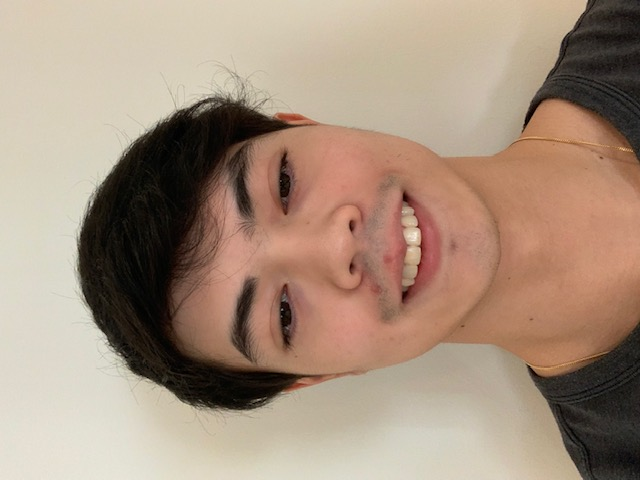

# Hugo's Page

```
int main()
{
    print("Welcome to my page");
}

```


**Brazillian**

***Computer Enginnering***

**UCSD**

***Age: 21***

~~Programmer~~ Software Engineering

## Skills

Computer Science Language:

- C++
- HTML
- CSS
- Phyton
- Java

Languagues:

1. Portuguese
2. English
3. Spanish 

## Projects

[Project 1](projects/project1.md)


## Degree

[x] School Degree

[x] Associate in Scinence Degree

[ ] Bachelor Degree

[ ] Masters Degre 


>“Debugging is like being a detective in a crime movie where you’re also the murderer.” — Filipe Fortes


[Click here](/file.md)

